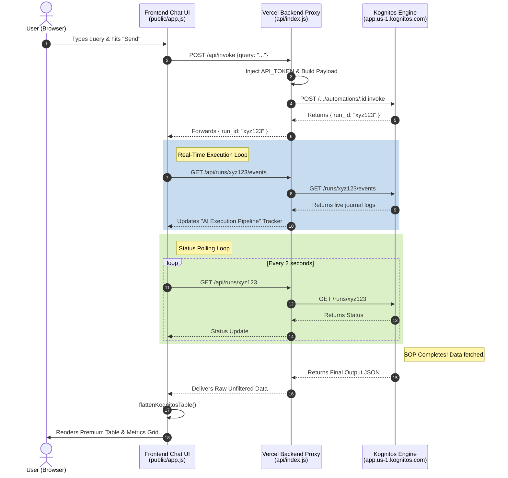

# Kognitos AI Assistant: System Architecture & Workflow

This document outlines the architecture, data flow, and components of the Kognitos AI Dashboard.

## 1. System Architecture Diagram

## 2. High-Level Architecture
The application is built using a **Proxy Architecture**. This ensures that the frontend (what the user sees) never communicates directly with Kognitos. Instead, it talks to a securely hosted backend, which then forwards the request to Kognitos.

**Components:**
1. **Frontend (Client)**: HTML/CSS/JavaScript running in the user's browser.
2. **Backend (Server/Proxy)**: A Node.js backend configured for Vercel Serverless Functions (`api/index.js`).
3. **Kognitos Engine**: The cloud-based AI system executing automation SOPs and accessing databases.

---

## 3. The Request Lifecycle: Step-by-Step

### Phase 1: User Input (Frontend)
1. You type your query into the text box and press **Enter**.
2. The `handleSend()` function in `app.js` is triggered.
3. The frontend displays the "Analyzing your request..." typing indicator and sends an HTTP POST request to `/api/invoke` with `{ "query": "..." }`.

### Phase 2: Forwarding to Kognitos (Backend Proxy)
1. Your backend intercepts the `/api/invoke` request.
2. The backend gathers your secure credentials from `process.env`. *Because this happens on the server, your private API token is completely hidden from the browser.*
3. The backend structures the query into Kognitos' expected format and sends it to the Kognitos Cloud via HTTPS.
4. Kognitos starts the automation and replies with a unique **Run ID**, which the backend passes back to the frontend.

### Phase 3: Real-Time Polling & The AI Pipeline
Knowing the `Run ID`, the frontend must wait for Kognitos to finish. It manages this using two concurrent streams:

**Stream 1: The Activity Tracker (`/events`)**
- The frontend constantly queries the "events" channel. As Kognitos evaluates logic, accesses databases, and processes data, the browser receives live logs.
- The UI filters out purely technical noise and updates the green **AI Execution Pipeline** laser tracker, advancing the progress bar for every new pipeline stage detected.

**Stream 2: The Status Checker (`/api/runs/:id`)**
- Every 2 seconds, the frontend asks the backend "Is Run ID finished yet?".
- If Kognitos responds "completed," it attaches the final extracted data (`outputs`).

### Phase 4: Constructing the Final Result
Once the "completed" status is received:
1. **Data Transparency**: The JavaScript scans every field in the Kognitos output. It dynamically discovers tables and values without artificially filtering the data.
2. **Table Flattening**: Because Kognitos may return nested JSON objects, the `flattenKognitosTable()` function recursively unnests the data into a clean, flat 2D row/column format.
3. **Rendering**: The UI takes the flattened data, closes the physical pipeline tracker, marks it as "Success", and renders the responsive, premium "Processed Information" grid cards and tables on the screen.

---

## 4. Environment Variable Security

Your application must authenticate with Kognitos, but exposing an API token in JavaScript is a massive security risk.

**The Solution:**
Instead of exposing the keys to the user's laptop, the frontend makes a request to your Vercel Proxy. The proxy injects the `API_TOKEN` server-side and makes the request on the user's behalf. 
